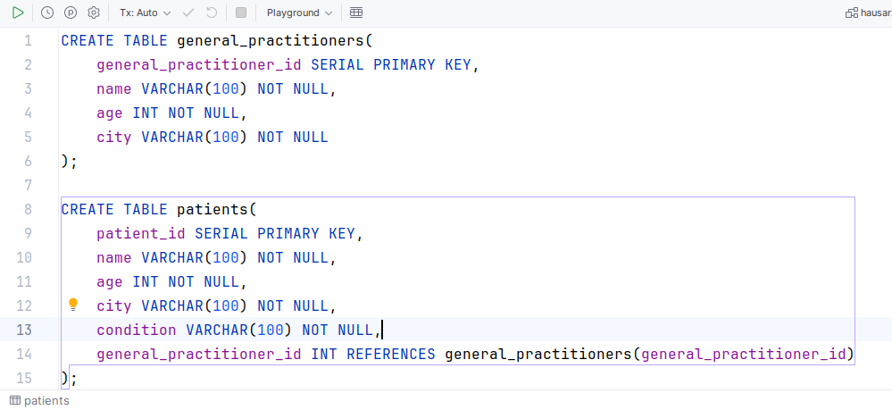
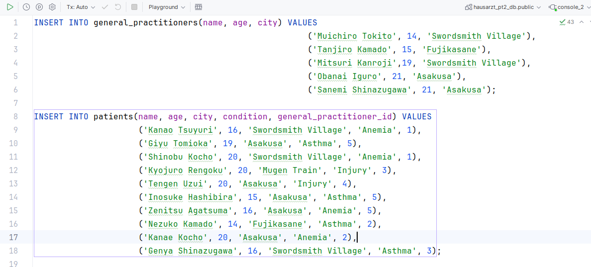
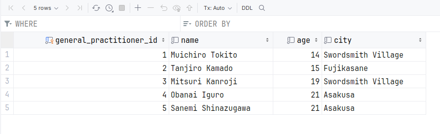
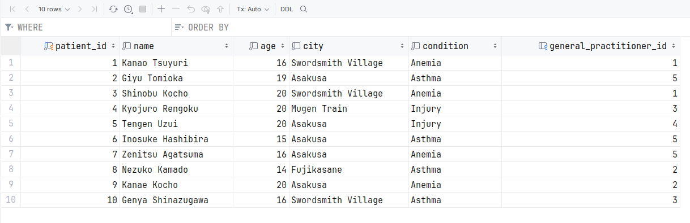
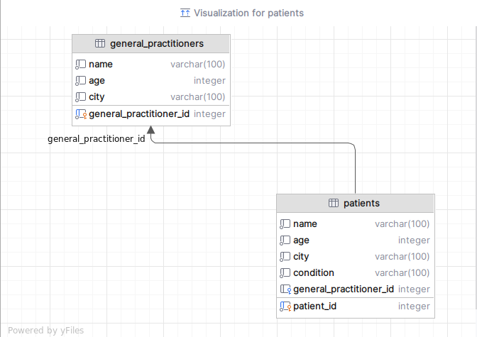
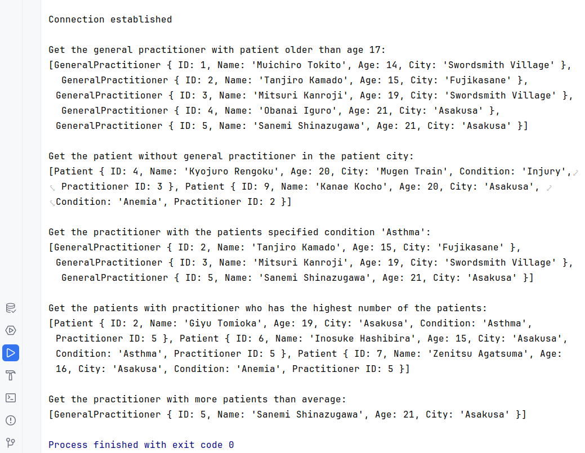
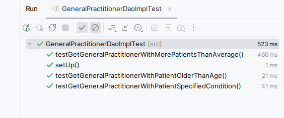
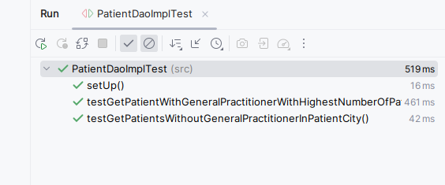

# -Pt.2-General-Practitioner-Management-System
My assignment for online course:
Java application with PostgreSQL using JDBC to manage a general practitioner (Hausarzt) system.
Assignment Description below.

###
- Create the tables

- Insert data into the tables

- General Practitioner table

- Patient table

- How the foreign keys are connected

- Run Main class with the required methods

- Run Test class for GeneralPractitionerDaoImpl

- Run Test class for PatientDaoImpl

---

---

### Assignment: Implementing a General Practitioner (Hausarzt) Management System - Part 2

#### Overview

Building on the foundational work from Part 1, Part 2 of the assignment focuses on deepening your understanding and practice of SQL subqueries, specifically targeting the use of `EXISTS`, `IN`, `NOT IN`, `ANY`, `SOME`, and `ALL` operators, as well as single-row comparison subqueries. This part will challenge you to create more complex queries that involve checking conditions against groups of records. As in Part 1, this is a self-guided educational exercise without evaluation.

#### Required Tasks

1. **Enhance the Database Schema**
    - No additional tables are required. Continue using `general_practitioners` and `patients`.

2. **Implement Advanced SQL Queries**
    - **Queries to Implement:**
        - Find all general practitioners who have patients older than a certain age.
        - List patients who do not have a general practitioner in a specific city.
        - Identify general practitioners who have patients with any of a list of specified conditions.
        - Find patients whose general practitioner has the highest number of patients.
        - Select all general practitioners who have more patients than the average number of patients per general practitioner.

3. **Update Java DAO Implementations**
    - Incorporate methods in `GeneralPractitionerDaoImpl.java` and `PatientDaoImpl.java` to execute the new SQL queries.

4. **Demonstration Main Class (Extended)**
    - Extend the main class from Part 1 to demonstrate the functionality of the new queries.

#### Guide to Each Task

1. **Enhance the Database Schema**
    - Use the existing schema from Part 1. Ensure your schema supports the necessary queries, such as having age and city information for patients and conditions if not already included.

2. **Implement Advanced SQL Queries**
    - **Find GPs with Patients Older Than X**: Use a subquery with `EXISTS` to check for the existence of patients older than a certain age for each GP.
    - **List Patients Without GPs in City Y**: Use a `NOT IN` subquery to exclude patients whose GPs are located in a specific city.
    - **GPs with Patients Having Any Condition**: Implement a query with `ANY` or `SOME` to find GPs who have patients with any condition from a specified list.
    - **Patients of the GP with the Most Patients**: Utilize a single-row comparison subquery to find patients whose GP has the highest patient count.
    - **GPs with Above Average Patient Counts**: Use a subquery with `ALL` to select GPs who have more patients than the average across all GPs.

3. **Update Java DAO Implementations**
    - For each new query, implement a corresponding method in the DAO implementations. Ensure methods return appropriate data types (e.g., lists of model objects).

4. **Demonstration Main Class (Extended)**
    - Demonstrate each new query by adding examples to the main class. Include clear print statements to indicate which query is being demonstrated and its results.

#### Implementation Notes

- Pay special attention to SQL query performance. Subqueries, especially when used improperly, can lead to slow query execution.
- Test each new SQL query independently using a database tool before integrating it into your Java application. This approach helps isolate and fix any issues early.
- Consider edge cases for your queries, such as GPs with no patients or patients with conditions not in your specified list.

This part of the assignment aims to enhance your ability to write complex SQL queries and integrate them into a Java application, providing a more comprehensive understanding of database management and manipulation.

